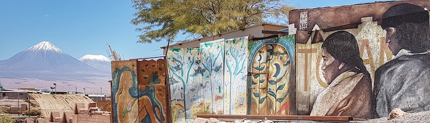

askemata 
======== 

Introdução
----------
Objetivos deste espaço: agrupar *links*, textos e referências sobre História da Filosofia, História das Ciências, História das Ciências Humanas e História da Psicologia. 

Também aqui: alguns [textos publicados](publicacoes.html) e links para o meu blog *[askesis](https://askesis.hypotheses.org)* e minhas páginas [PhilPapers](http://philpeople.org/profiles/marcio-miotto), [ORCID](https://orcid.org/0000-0003-0608-0542), Academia e meu blog [Philosopher’s Desk](https://philosophersdesk.blogspot.com/). 

Note: Há igualmente recursos públicos, gratuitos e *open source* para pesquisadores em ciências humanas.  

Posts in Português [PT], Français [FR], Español [ES] and English [EN]. 

Menus 
----- 
Achtung! A lista de menus, acima, distribui o conteúdo. (*Work in progress*)

